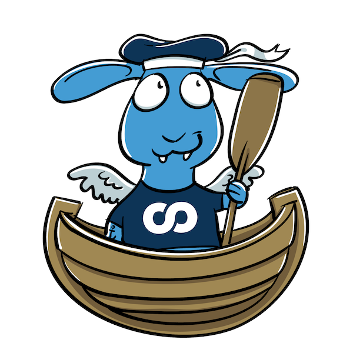

[](https://github.com/foomo/keel/actions/workflows/test.yml)
[](https://goreportcard.com/report/github.com/foomo/keel)
[](https://godoc.org/github.com/foomo/keel)

<p align="center">
  
</p>

# keel

> Opinionated way to run services on Kubernetes

## Stack

- Zap
- Nats
- Viper
- GoTSRPC
- Temporal
- OpenTelemetry

## Examples

See the examples folder for usages

```go
package main

import (
  "net/http"

  "github.com/foomo/keel"
  "github.com/foomo/keel/service"
)

func main() {
  svr := keel.NewServer(
    keel.WithHTTPZapService(true),
    keel.WithHTTPViperService(true),
    keel.WithHTTPPrometheusService(true),
  )

  l := svr.Logger()

  svs := newService()

  svr.AddService(
    service.NewHTTP(l, "demo", "localhost:8080", svs),
  )

  svr.Run()
}

func newService() *http.ServeMux {
  s := http.NewServeMux()
  s.HandleFunc("/", func(w http.ResponseWriter, r *http.Request) {
    w.WriteHeader(http.StatusOK)
    _, _ = w.Write([]byte("OK"))
  })
  return s
}
```

## How to Contribute

Contributions are welcome! Please read the [contributing guide](docs/CONTRIBUTING.md).


## License

Distributed under MIT License, please read the [license file](LICENSE) for more details.

_Made with ♥ [foomo](https://www.foomo.org) by [bestbytes](https://www.bestbytes.com)_
